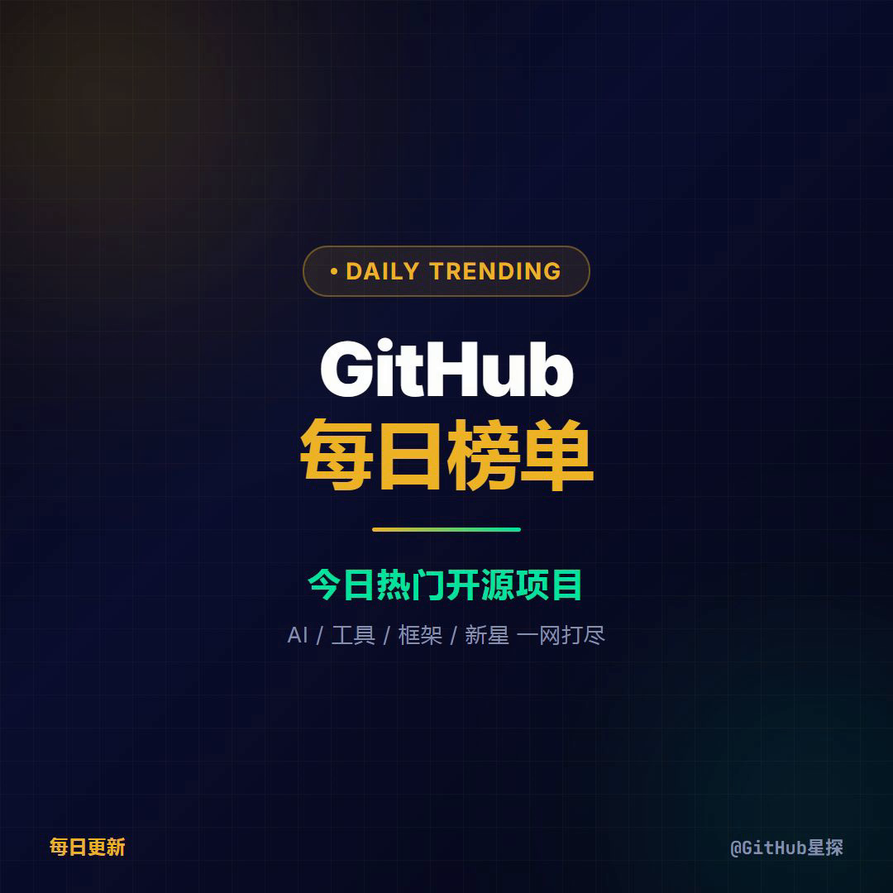
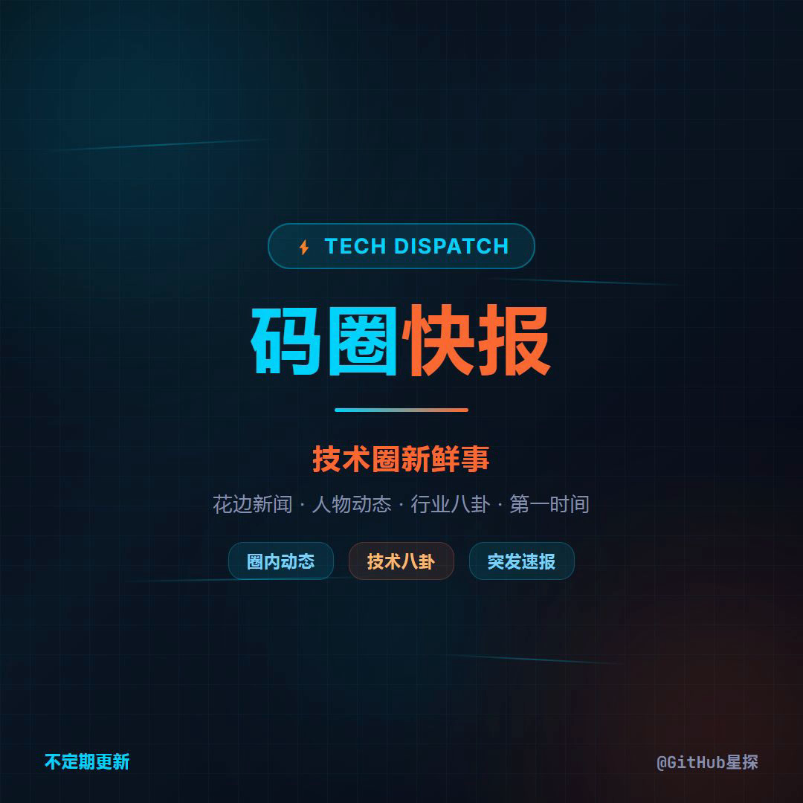
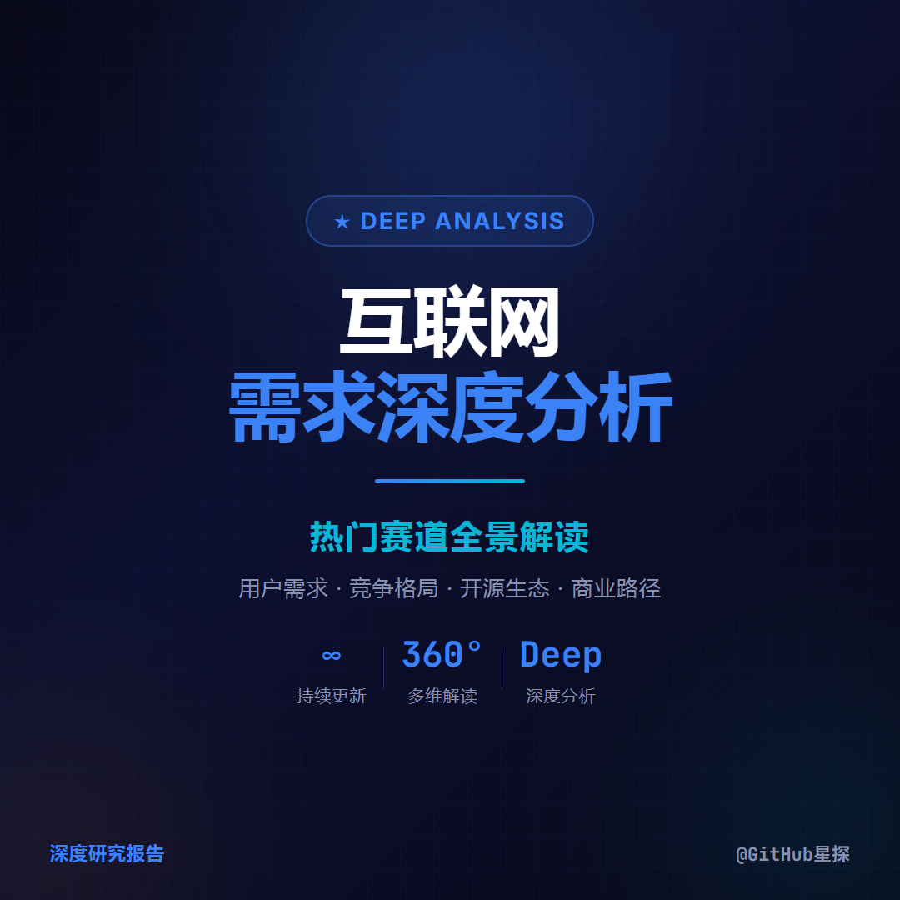
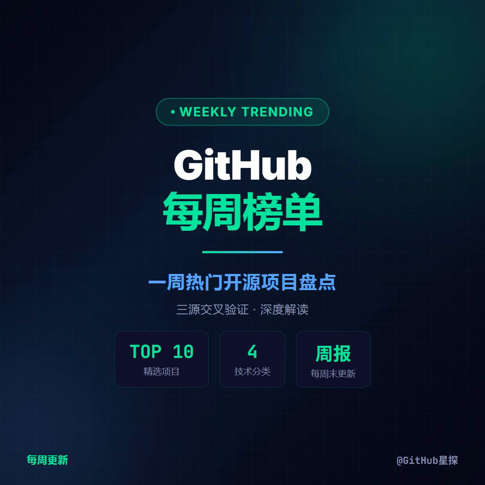

<div align="center">

# GitHub 星探 · 视频存档

每天用 AI 把 GitHub 上最火的项目变成 45 秒短视频。

**17 天 · 39 条视频 · 5 个系列 · 全自动**

数据驱动 · 开源解读 · 行业趋势

[](https://git-lfs.github.com/)

</div>

---

## 系列封面

每一条视频都由 [ClipForge](https://github.com/Johnson-Jia/video-clipforge) 自动生成 — 从数据抓取、文案编写、配音配乐到视频渲染，全程 AI 完成，无需人工干预。

<div align="center">

| | | | | |
|:---:|:---:|:---:|:---:|:---:|
|  |  |  |  |  |
| GitHub 星探<br>每日热门 | 开源亮点<br>单项目深度 | 科技速递<br>行业趋势 | 互联网报告<br>深度解读 | 周度汇总<br>一周精选 |

</div>

---

## 近期作品

### 每日热门 · GitHub Trending

| 日期 | 作品 |
|:---|:---|
| 5月28日 | [GitHub 每日热门](2026/05/28/github-trending/) |
| 5月27日 | [GitHub 每日热门](2026/05/27/github-trending/) |
| 5月26日 | [GitHub 每日热门](2026/05/26/github-trending/) |

### 周度汇总 · Weekly

| 日期 | 作品 |
|:---|:---|
| 5月25日 | [GitHub 周度热门汇总](2026/05/25/github-trending-weekly/) |

### 深度解析

| 日期 | 作品 |
|:---|:---|
| 5月28日 | [AI 对企业培训行业的冲击](2026/05/28/ai-training-impact/) |
| 5月28日 | [GLM vs Qwen 大模型对比](2026/05/28/glm-vs-qwen-compare/) |
| 5月27日 | [Claude Code 深度解析](2026/05/27/claude-code-deep-dive/) |
| 5月26日 | [代码知识图谱工具对比](2026/05/26/code-knowledge-graph-compare/) |
| 5月25日 | [AI 硬件与可穿戴设备](2026/05/25/ai-hardware-wearable/) |
| 5月23日 | [Service as Software 长视频](2026/05/23/service-as-software/) |

### 开源亮点

| 日期 | 作品 |
|:---|:---|
| 5月22日 | [即时零售深度调研](2026/05/22/instant-retail-deep-dive/) |
| 5月22日 | [视频生成开源项目盘点](2026/05/22/video-generation-projects/) |
| 5月17日 | [RuView：WiFi 穿墙感知](2026/05/17/ruview/) |

> 查看 [`2026/`](2026/) 目录浏览全部 39 条视频。

---

## 这些视频是怎么做的

<div align="center">

**[ClipForge](https://github.com/Johnson-Jia/video-clipforge)** — 把知识变成短视频的 AI 管线

告诉它你想讲什么，它帮你写稿、配音、做画面、出成片。

想在自己的领域做同样的事？ → **[了解 ClipForge →](https://github.com/Johnson-Jia/video-clipforge)**

</div>

---

> **以下为仓库结构和技术细节，面向开发者和贡献者。**

---

## 目录结构

```
workspace/
├── covers/                              # 系列封面模板（daily / weekly / spotlight / tech-dispatch / internet-reports）
├── bgm/                                 # BGM 素材库（10 种风格 × 5 首变体，跨项目复用）
├── sources/                             # 内容源文件（报告、数据、参考资料）
│
└── <YYYY>/<MM>/<DD>/                    # 按日期归档的视频项目
    ├── github-trending/                 #   每日 GitHub 热门视频
    ├── github-trending-weekly/          #   每周 GitHub 汇总视频
    ├── github-zhihu/                    #   每周知乎文章
    └── <项目名>/                        #   自定义主题视频
```

### 视频项目文件结构

清理后的项目目录保留核心产出物：

```
<项目目录>/
├── final.mp4                  # 最终视频（含 BGM）
├── final_no_bgm.mp4           # 无 BGM 版本（仅旁白）
├── cover.png                  # 封面图
├── cover.html                 # 封面 HTML（可重渲染）
├── index.html                 # HTML 组合（可重渲染）
├── design.md                  # 视觉风格
├── narration.txt              # 旁白文案
├── narration_segments.json    # 分段旁白定义
├── segment_durations.json     # 分段时长 + BGM 音量
├── douyin.md                  # 抖音发布文案（3 套风格）
└── narration.mp3              # 合并旁白
```

## 视频模式

| 模式 | 时长 | 场景数 | 说明 |
|------|------|--------|------|
| **标准模式** | 25-55s | 6-8 | 信息密度优先，多项目盘点 |
| **单主题深度解析** | 45-60s | 7-8 | 覆盖原理、能力、应用等维度 |
| **电影解读模式** | 3-5min | 不限 | 含电影片段提取与拼接 |

## BGM 素材库

`bgm/` 目录按风格分类存储配乐，每种风格 5 首变体。来源为 Pixabay 无版权音乐（免版税，可商用）。

| 风格 | 适用场景 |
|------|---------|
| Bold Energetic | 科技动态、项目盘点 |
| Clean Corporate | 专业解读、行业报告 |
| Dark Premium | 深度分析、产品评测 |
| Warm Editorial | 温暖叙事、人物故事 |
| Neon Electric | 前沿科技、赛博朋克 |
| Pastel Soft | 生活化、治愈话题 |
| Jewel Rich | 高端质感、精品推荐 |
| Monochrome | 极简风格、数据展示 |
| Nature Earth | 自然主题、环保话题 |
| Warm Ambient | 轻松背景、氛围铺垫 |

## Git LFS

本仓库使用 Git LFS 管理大文件（`.wav` 等）。克隆后请确保已安装：

```bash
git lfs install
```

## 关联项目

- **[ClipForge](https://github.com/Johnson-Jia/video-clipforge)** — AI 短视频制作管线，负责从内容到成片的全流程编排
- **[HyperFrames](https://github.com/heygen-com/hyperframes)** — HTML 视频渲染引擎

## 支持作者

如果这些视频或素材对你有帮助，欢迎请创作者喝杯咖啡 ☕

毕竟，AI 不会累，但让 AI 干活的人会。

<table>
  <tr>
    <td align="center">
      <strong>支付宝</strong><br/>
      
    </td>
    <td align="center">
      <strong>微信</strong><br/>
      
    </td>
  </tr>
</table>

## License

[Apache License 2.0](https://github.com/Johnson-Jia/video-clipforge/blob/main/LICENSE)
